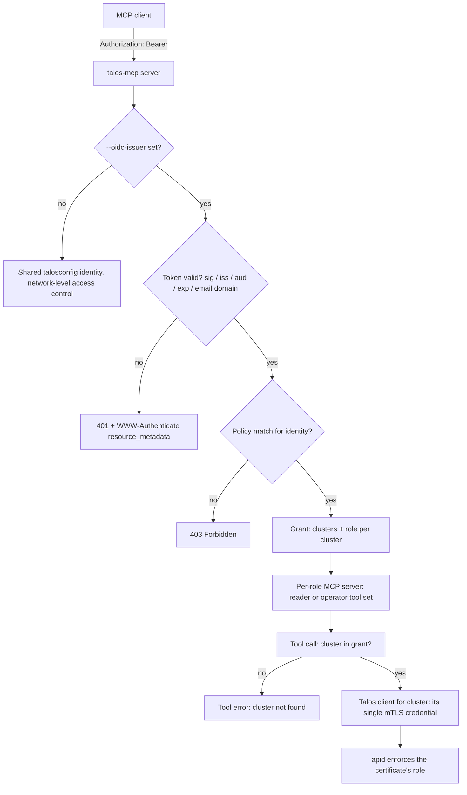
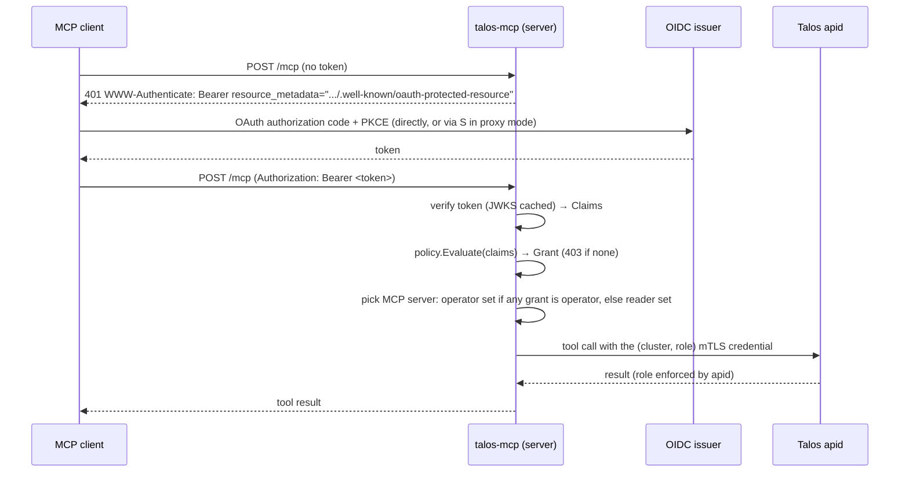

# Talos MCP Server — OIDC Authentication (Design, Future)

Status: **proposed**. This feature is not part of v1 (see `design.md` §12–13).

## 1. Problem

In `server` (streamable HTTP) mode, every caller shares the mTLS client
certificate from the mounted talosconfig. Anyone who can reach `/mcp` gets
that certificate's full Talos role, and Talos only ever sees one identity.

The sibling project `mimiops-mcp` solves this with **OIDC passthrough**: it
verifies the user's token and forwards it to the Kubernetes API server, which
authenticates the user and enforces RBAC itself (`mimiops/docs/oidc.md`).

**That doesn't work for Talos.** apid authenticates clients only with mTLS
certificates signed by the cluster's OS CA. Authorization is the role list in
the certificate's Subject Organization (`os:reader`, `os:operator`,
`os:admin`, ...). Talos doesn't understand bearer tokens, OIDC, or user
identities, so there's nothing to pass a token through to.

So with OIDC enabled, **talos-mcp itself becomes the authentication and
authorization point.** It verifies the third-party token, maps the identity
to a policy, and then calls Talos with a certificate that matches the role
the policy grants.

## 2. Goals

- Authenticate HTTP MCP clients with tokens from a third-party OIDC provider
  (Keycloak, Dex, Zitadel, Entra ID, Okta, Auth0, Google, GitHub through Dex).
- Authorize per identity: which **clusters** a user can see, and which
  **role** (reader or operator) they get on each cluster.
- Never give a user more than their policy allows, and never more than the
  cluster's single credential allows (§5).
- Each user sees only what they're allowed to use. `tools/list` and
  `talos_clusters_list` reflect the caller's policy.
- Keep an audit trail of who did what. Talos sees only the shared certificate,
  so the MCP server's log is the only per-user record.
- Off by default. Behavior without `--oidc-issuer` is unchanged.
- Reuse mimiops code: the verifier, protected-resource metadata, and OAuth
  proxy mode.

## 3. Non-goals

- Forwarding tokens to Talos. Talos can't use them, so tokens never leave the
  MCP server.
- OIDC for the `mcp` (stdio) and `tools` subcommands. Those run as the local
  user with their own talosconfig.
- Replacing Omni. Omni already provides SSO (SAML/OIDC) in front of Talos with
  per-user, short-lived Talos access. Teams that want SSO for Talos broadly,
  not just for the MCP server, should use Omni (see §11).
- Issuing the server's own access tokens. The server keeps the mimiops model
  and passes the provider's token through to the client.

## 4. Security Model



Three independent layers have to agree before a destructive call goes
through:

1. **Policy** (talos-mcp): the identity is granted `operator` on the cluster.
2. **Registration and role gating** (talos-mcp, design §9):
   `--allow-destructive` is set and the cluster's credential role is
   `operator`, so `talos_node_reboot` exists and accepts that cluster.
3. **Certificate** (Talos): the cluster's single credential really carries
   `os:operator`.

Any one of them can deny the call. Layer 3 is enforced by Talos, so even a
bug in talos-mcp's policy code can't do more than the cluster's certificate
allows. Within that ceiling, layer 1 is the only thing separating users from
each other (§5).

## 5. Credential Model

talosconfig holds **one credential per cluster**, the same as without OIDC.
That certificate's role (`reader` or `operator`, design §2.3) is the
**ceiling** for every user on that cluster. OIDC can only **narrow** access,
never widen it:

```
effective_role(user, cluster) = min(policy_grant(user, cluster), credential_role(cluster))
```

| Credential role | Policy grant | Effective role | Reboot? |
| --------------- | ------------ | -------------- | ------- |
| operator        | operator     | operator       | yes (with `--allow-destructive`) |
| operator        | reader       | reader         | no      |
| reader          | operator     | reader         | no (startup warning, see §6) |
| reader          | reader       | reader         | no      |
| any             | none         | — (cluster hidden) | —   |

- Both roles on one cluster use the same certificate. A reader-level user on
  an operator cluster calls apid with the `os:operator` certificate, but
  talos-mcp only lets them use read-only tools. On those clusters, talos-mcp
  is the only thing enforcing that a reader user stays read-only (§4, layer
  1). This is the main trade-off of having one credential per cluster.
- Operators who need Talos itself to enforce read-only access for some users
  should give the cluster an `os:reader` credential, which makes it read-only
  for everyone. A second MCP deployment can hold the `os:operator` credential
  for the people who need it.
- The server never holds CA material. Certificates are long-lived and shared,
  so Talos logs can't tell users apart, and the MCP audit log fills that gap
  (§9).

### 5.1 Future: per-user short-lived certificates (opt-in)

The single credential per cluster could later be replaced by certificates
minted per user from the cluster's **OS CA key**:

- `CN = <email or sub>` and `O = <effective role>`
- `NotAfter = min(token exp, now + 1h)`

That would make Talos enforce each user's role and carry the identity in the
certificate. However, **the CA key can mint `os:admin`**. A compromised
server would then mean full control of every cluster. It would need:

- the key kept in a KMS or HSM with a signing-only API;
- a hard-coded allowlist of roles that may be minted;
- a separate opt-in flag (`--oidc-credential-mode=mint`).

The grant model above doesn't block this option. It is **not** planned for
the first OIDC release.

## 6. Policy

A YAML file passed with `--oidc-policy`. Rules are evaluated top to bottom,
the first matching rule wins, and **anything unmatched is denied.**

```yaml
# Cluster names are talosconfig context names. Each context's credential
# role caps what any grant can give (§5).
rules:
  - name: sre
    match:
      groups: [talos-sre]            # any of
    grants:
      - clusters: ["*"]
        role: operator

  - name: developers
    match:
      groups: [developers]
      email_domains: [example.com]   # all match keys must hold (AND)
    grants:
      - clusters: [staging]
        role: operator
      - clusters: ["prod-*"]
        role: reader

  - name: oncall-bot
    match:
      subjects: ["svc-oncall@clients"]  # exact `sub` claim
    grants:
      - clusters: ["prod-*"]
        role: reader
```

Semantics:

- `match` keys are combined with AND, and the values inside a key with OR.
  Supported keys:
  - `groups`, read from the claim set by `--oidc-groups-claim` (default
    `groups`)
  - `emails`, the exact `email` claim, which requires `email_verified=true`
  - `email_domains`
  - `subjects`, the exact `sub` claim
- `clusters` entries are names or globs (`path.Match` syntax). When one user
  gets several grants for the same cluster, the highest role wins.
- `role` is `reader` or `operator`. It is capped by the cluster's credential
  role (§5).
- The resulting **grant** holds effective roles, for example
  `map[cluster]role{prod-eu: reader, staging: operator}`.
- The policy is loaded and validated at startup. Unknown clusters in a
  `clusters` list are a startup error unless they are globs. A rule that
  grants `operator` on a cluster whose credential is `os:reader` produces a
  warning ("grant capped to reader"), so a misconfiguration is visible.
  Reloading on `SIGHUP` is future work.

Groups claim caveats: Entra ID can return overage instead of a groups list,
Google has no groups claim, and GitHub only provides one through Dex. Rules
can use `email_domains`, `emails` or `subjects` instead. A token that has no
groups claim simply doesn't match any `groups` rule.

## 7. Request Flow



### 7.1 Per-identity tool sets

Without OIDC, tool registration follows the credential roles (design §9).
With OIDC, it follows each caller's **effective** roles.
`mcp.NewStreamableHTTPHandler(getServer, ...)` chooses a server per request,
and the process builds **two** `*mcp.Server` instances at startup:

| Server     | Tools                                                                   |
| ---------- | ----------------------------------------------------------------------- |
| `reader`   | all read-only tools                                                     |
| `operator` | read-only tools + `talos_node_reboot` (only when `--allow-destructive` is set and at least one credential is `operator`) |

`getServer` returns `operator` when the caller has at least one effective
operator role, and `reader` otherwise. A reader-only user therefore never
sees `talos_node_reboot` in `tools/list`. The reboot tool's `cluster` enum
(design §9) lists every operator-credential cluster. The per-call check below
narrows that list to the caller's own operator clusters.

A session is tied to the identity that opened it. If a later request on the
same session ID carries a token for a different `sub`, it is rejected with
401. This prevents session-ID reuse across users.

### 7.2 Per-call enforcement

The existing per-call check `pool.Require(cluster, minRole)` (design §9)
becomes grant-aware. The grant travels in the request context
(`auth.Inject` / `auth.FromContext`):

```go
// Without a grant in ctx: checks the credential role only (today's behavior).
// With a grant: checks min(grant, credential role).
func (p *Pool) Require(ctx context.Context, cluster string, min Role) error
```

- If the cluster isn't in the grant, the call fails with **"cluster not
  found"**, the same error as for a cluster that doesn't exist. This avoids
  revealing cluster names.
- If the effective role is below the tool's minimum role, the call fails with
  "permission denied: operator role required on <cluster>". The message says
  whether the policy or the credential is the limit.
- `talos_clusters_list` (including its per-cluster `role` and `tools`
  fields), `Pool.Members` and discovery lookups are filtered to the grant and
  show effective roles. Discovery secrets of clusters outside the grant are
  never used on that user's behalf.

Tools don't change. They already call `Require` with their minimum role, and
OIDC only adds the grant to the context.

## 8. Configuration

Flags follow the pattern in `cmd/talos-mcp/flags.go` (each has an env
fallback). The first six are the same as in mimiops, so deployments can share
documentation.

| Flag                   | Env                  | Default                | Description |
| ---------------------- | -------------------- | ---------------------- | ----------- |
| `--oidc-issuer`        | `OIDC_ISSUER`        | ""                     | Issuer URL; enables OIDC. Must be `https://`. |
| `--oidc-client-id`     | `OIDC_CLIENT_ID`     | ""                     | Required value in `aud`. |
| `--oidc-email-domains` | `OIDC_EMAIL_DOMAINS` | ""                     | Global allowlist checked before policy; empty allows all. |
| `--oidc-callback-url`  | `OIDC_CALLBACK_URL`  | ""                     | Enables OAuth proxy mode (Google and other providers without DCR). |
| `--oidc-client-secret` | `OIDC_CLIENT_SECRET` | ""                     | Upstream client secret for proxy mode. |
| `--oidc-scope`         | `OIDC_SCOPE`         | `openid profile email` | Scopes requested in proxy mode. |
| `--oidc-policy`        | `OIDC_POLICY`        | ""                     | Policy file (§6). **Required** when OIDC is on. |
| `--oidc-groups-claim`  | `OIDC_GROUPS_CLAIM`  | `groups`               | Claim holding group names (string or array). |

Startup fails fast if:

- `--oidc-issuer` is set without `--oidc-policy`;
- discovery against the issuer fails;
- the policy is invalid;
- a policy references a cluster that has no usable credential (design §2.3);
- OIDC flags are passed to `mcp` or `tools`, which is rejected with an error
  rather than silently ignored.

Helm chart: `oidc.enabled`, `oidc.issuer`, `oidc.clientId`,
`oidc.existingSecret` (client secret), and `oidc.policy`, which is rendered
into a ConfigMap. The talosconfig Secret is unchanged: one context, and one
credential, per cluster.

## 9. Audit Logging

Talos sees only the shared role certificate, so the MCP server's log is the
system of record for who did what.

- Every `tools/call` logs: `sub`, `email` (if present), the matched rule name,
  tool, cluster, node, the role used, the result (ok / error code) and the
  duration. This extends the existing `loggingMiddleware`.
- `talos_node_reboot` logs at `warn`, both before the call and after it is
  accepted, so a crash in between still leaves a record.
- Denials are logged at `info` with the reason: 403 with no policy match,
  "cluster not in grant", or "role too low".
- Tokens, claims other than `sub`/`email`/groups, and certificate material are
  never logged. The sanitizer masks JWTs as a second line of defense.
- With `--log-format=json`, these records can be shipped to a SIEM as they
  are.

## 10. Package Layout

```
internal/oidc/      Verifier, Claims, context helpers — ported from mimiops
internal/policy/    policy file parsing, Evaluate(claims) → Grant, glob matching
internal/auth/      Grant/Role types, Inject/FromContext
internal/talos/     Pool.Require(ctx, cluster, min): grant-aware role check
cmd/talos-mcp/
    server_oidc.go             HTTP auth middleware: 401/403, session↔sub binding
    server_oauth_discovery.go  /.well-known/oauth-protected-resource — ported
    server_oauth_proxy.go      OAuth proxy mode — ported
```

Layering: `internal/tools` never imports `oidc` or `policy`. It only declares
the role it needs. `internal/talos` reads `auth.Grant` from the context.
`cmd/talos-mcp` wires verifier → policy → grant → context.

Dependency: `github.com/coreos/go-oidc/v3`, the same one mimiops uses.

## 11. Alternatives Considered

| Alternative | Why not (as the primary design) |
| ----------- | ------------------------------- |
| Forward the token to Talos | Talos can't verify tokens; it only does mTLS. |
| Authenticating reverse proxy in front of talos-mcp (oauth2-proxy, Pomerium, Cloudflare Access) | Works today without code changes, but it's all-or-nothing: there are no per-cluster or per-role grants, no filtered `tools/list`, and no identity in the MCP audit log. It's still a valid quick option, and it can be combined with this design if the proxy forwards a verified JWT. |
| Omni with SSO, and talos-mcp using Omni `siderov1` contexts | The best end-to-end answer when Omni is already in use: Omni does SSO and issues per-user Talos access. It depends on Omni support in talos-mcp (design §13) and on per-user Omni service accounts. It should be revisited as a third credential mode. |
| Per-user certificates minted from the OS CA | Kept as opt-in future work because of the CA-key risk (§5.1). |

## 12. Testing

- `internal/policy`: table tests for match semantics (AND/OR), globs, highest
  role wins, default deny, unknown clusters, and a missing groups claim.
- `internal/talos`: `Require` with a grant missing the cluster (returns
  "cluster not found"), an effective role capped by an `os:reader`
  credential, an effective role capped by the policy on an `os:operator`
  credential, and no grant in the context (today's behavior).
- `cmd/talos-mcp`: an HTTP test with a fake issuer (in-process JWKS) covering
  401 without a token, 403 with no rule, a reader's `tools/list` without
  reboot, an operator's `tools/list` with reboot (and without it when
  `--allow-destructive` is off), a session reused by another `sub` (401), and
  the protected-resource metadata endpoints.
- Ported mimiops verifier and proxy tests.

## 13. Open Questions

1. **Per-node scoping.** Should grants be able to limit nodes, for example
   workers only? Talos certificates can't express this, so talos-mcp would be
   the only enforcement point.
2. **Reader users on operator clusters.** Is enforcement by talos-mcp alone
   acceptable here (§5)? The alternative is to require such clusters to be
   served by a separate MCP deployment.
